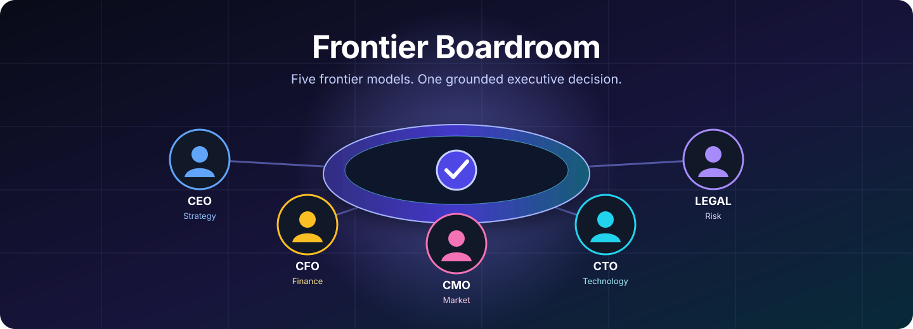
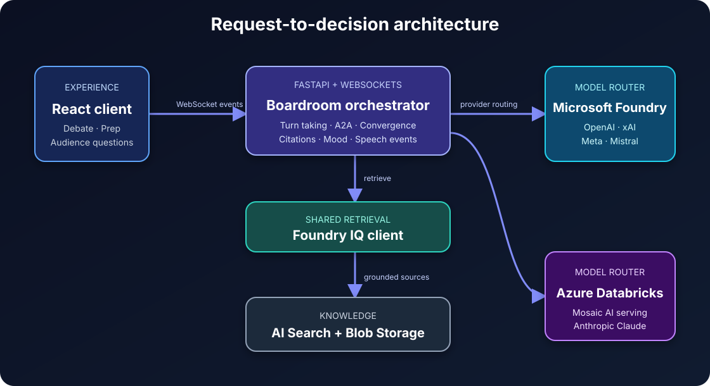

<p align="center">
  
</p>

<p align="center">
  <strong>A multi-model AI executive team that debates strategic questions, cites company knowledge, and converges on a decision in real time.</strong>
</p>

<p align="center">
  <a href="https://app-frontier-prod-frontend.azurewebsites.net">Live demo</a>
  ·
  <a href="#run-locally">Run locally</a>
  ·
  <a href="#deploy-to-azure">Deploy to Azure</a>
  ·
  <a href="docs/demo-runbook.md">Demo runbook</a>
</p>

---

## What is Frontier Boardroom?

Frontier Boardroom is an open-source demonstration of five AI agents acting as a
virtual C-suite:

- **CEO** facilitates the discussion and synthesizes the decision.
- **CFO** evaluates financial impact, runway, and commercial risk.
- **CMO** represents customers, positioning, and go-to-market strategy.
- **CTO** assesses architecture, delivery capacity, and technical trade-offs.
- **Legal** examines regulatory, contractual, privacy, and employment risk.

Ask the board a strategic question such as _"Should we expand into Southeast
Asia next quarter?"_ Each executive retrieves relevant evidence, responds from
its own perspective, challenges the other agents, and contributes to a final
recommendation and vote.

The application also includes **Prep mode** for private, one-to-one coaching with
any executive persona. A user in the CEO seat can delegate a question to another
seat with an `@mention`, for example `@CTO estimate the delivery risk`, and then
receive a CEO synthesis grounded in the delegated response.

> The included Aksara Cloud company, scenarios, and knowledge base are fictional
> demo data. Replace them with your own approved content before using the project
> for real business decisions.

## Why use it?

Frontier Boardroom is useful as:

| Use case | What it demonstrates |
| --- | --- |
| Executive decision workshop | Multiple specialist agents debate one strategic question instead of producing isolated answers. |
| Architecture reference | Provider-independent routing across Microsoft Foundry and Azure Databricks Mosaic AI. |
| Grounded AI demo | Every agent shares one retrieval layer and returns source citations with factual claims. |
| Model comparison | Models can be reassigned to executive roles without changing persona or orchestration code. |
| Board-meeting preparation | Leaders can coach, pressure-test, and delegate questions before a meeting. |
| Keynote or customer demo | Streaming responses, audience questions, voting, and a recorded fallback create a resilient live experience. |

## Product experience

1. Select a prepared scenario or enter a custom strategic question.
2. Watch five executives respond in a live, Teams-style conversation.
3. Open citations to inspect the evidence behind an argument.
4. Follow the server-controlled mood as the discussion moves from cordial to
   resolved.
5. Compare model assignments across the five specialist roles.
6. Review the final decision and each executive's vote.
7. Switch to Prep mode for a private coaching or pressure-testing session.

## Architecture

<p align="center">
  
</p>

The FastAPI backend owns orchestration, grounding, model routing, mood, and
speech. The React client receives structured events over WebSockets and never
decides debate state on its own.

- **Model routing:** every model reference uses
  `<provider>:<endpoint>`. OpenAI, xAI, Meta, and Mistral models are routed to
  Microsoft Foundry; Anthropic models are routed to Azure Databricks Mosaic AI.
- **Grounding:** every persona retrieves through the shared Foundry IQ client.
  Agents never read Blob Storage directly.
- **Streaming:** turns, tokens, citations, mood changes, audio, visemes, and the
  final decision are WebSocket events.
- **Identity:** Azure deployments use managed identity for Azure resources.
  Secrets required by external model endpoints are stored in Key Vault.
- **Demo safety:** the recorded `/dev/fake-debate` experience keeps the
  application demonstrable when live model services are unavailable.

### Technology

| Layer | Main technologies |
| --- | --- |
| Frontend | React 18, TypeScript, Vite, Zustand, Tailwind CSS |
| Backend | Python 3.12, FastAPI, Pydantic v2, WebSockets |
| Models | Microsoft Foundry and Azure Databricks Mosaic AI Model Serving |
| Knowledge | Microsoft Foundry IQ, Azure AI Search, Azure Blob Storage |
| Speech and emotion | Azure AI Speech, visemes, Azure AI Language |
| Hosting and operations | Azure App Service, ACR, Key Vault, Application Insights, Bicep |

## Run locally

### Prerequisites

- Git
- Docker Desktop with Docker Compose
- Optional for native development: Python 3.12 and Node.js 20
- Optional for live models: an Azure subscription with the services described
  in [Deploy to Azure](#deploy-to-azure)

### Option 1: Docker Compose

This is the quickest way to run both applications.

```bash
git clone https://github.com/sauravraghuvanshi/frontier-boardroom.git
cd frontier-boardroom
cp .env.example .env
docker compose up --build
```

On Windows PowerShell, use `Copy-Item .env.example .env` instead of `cp`.

Open:

- Frontend: <http://localhost:5173>
- Backend health: <http://localhost:8000/health>
- Interactive API docs: <http://localhost:8000/docs>

To force the credential-free recorded experience, set this value in `.env`
before starting:

```dotenv
USE_FAKE_DEBATE=true
```

### Option 2: Native development

Start the backend:

```powershell
Copy-Item .env.example .env
Set-Location backend
python -m venv .venv
.\.venv\Scripts\python -m pip install -r requirements.txt
.\.venv\Scripts\python -m uvicorn app.main:app --reload --port 8000
```

In a second terminal, start the frontend:

```powershell
Set-Location frontend
npm install
npm run dev -- --host 0.0.0.0
```

## Configure live services

Local development reads `.env`; Azure App Service reads environment settings
and Key Vault references. Do not commit a populated `.env`.

| Variable | Purpose |
| --- | --- |
| `AZURE_FOUNDRY_PROJECT_ENDPOINT` | Microsoft Foundry project endpoint used with Azure identity. |
| `AZURE_SEARCH_ENDPOINT` | Azure AI Search endpoint that hosts the Foundry IQ knowledge base. |
| `AZURE_FOUNDRY_KB_NAME` | Knowledge base name; defaults to `boardroom-iq`. |
| `DATABRICKS_HOST` | Azure Databricks workspace URL. |
| `DATABRICKS_TOKEN` | Local token for Databricks development. Use Key Vault references in Azure. |
| `AZURE_SPEECH_RESOURCE_ID` | Azure Speech resource ID for identity-based authentication. |
| `AZURE_SPEECH_REGION` | Azure Speech region. |
| `AZURE_LANGUAGE_ENDPOINT` | Azure AI Language endpoint. |
| `APPINSIGHTS_CONNECTION_STRING` | Application Insights connection string. |
| `MODEL_CEO`, `MODEL_CFO`, `MODEL_CMO`, `MODEL_CTO`, `MODEL_LEGAL` | Role assignments in `<provider>:<endpoint>` format. |
| `PUBLIC_*` | Per-client and global anonymous usage and concurrency limits. Keep these enabled for public deployments. |
| `ADMIN_API_TOKEN` | Secret required for model swaps and provider probes. Store it in Key Vault in Azure. |
| `VITE_API_BASE`, `VITE_WS_BASE` | Backend HTTP and WebSocket URLs embedded in the frontend build. |

Anthropic models are intentionally supported only through the Databricks
provider in this project. Do not configure an Anthropic endpoint as a Foundry
model.

The public UI displays model assignments but cannot change them. Model swaps are
an operator action through the administrator-protected API so anonymous users
cannot alter the experience for everyone else.

After configuring credentials, verify the backend and model routes:

```bash
curl --fail http://localhost:8000/health
cd backend
python -m app.agents.model_router probe
```

## Deploy to Azure

The repository contains Bicep modules and deployment scripts for the reference
Azure architecture. Deployment creates or configures App Service, Azure
Container Registry, Storage, Azure AI Search, Foundry resources, Speech,
Language, Key Vault, and Application Insights.

### Automatic production deployment

Every push to `master` runs the backend and frontend checks in
`.github/workflows/ci.yml`. When CI succeeds, GitHub automatically starts
`.github/workflows/deploy-app.yml`, which:

1. Authenticates to Azure with GitHub OIDC (no client secret).
2. Builds immutable backend and frontend images in ACR using the commit SHA.
3. Applies the public-demo safety limits.
4. Pins both App Services to the new images and restarts them.
5. Verifies health and confirms administrative endpoints remain protected.

The workflow uses the GitHub `prod` environment and requires
`AZURE_CLIENT_ID`, `AZURE_TENANT_ID`, and `AZURE_SUBSCRIPTION_ID` environment
secrets. These are non-secret identifiers for the federated deployment identity;
runtime model credentials remain in Azure Key Vault.

### Azure prerequisites

1. An Azure subscription where you can create resources and role assignments.
2. Azure CLI, Docker, Python 3.12, and Bash (Git Bash or WSL on Windows).
3. An authenticated Azure CLI session: `az login`.
4. Required model deployments in Microsoft Foundry.
5. An Azure Databricks workspace with the required Anthropic serving endpoints.
6. Permission to use the selected models in your region and tenant.

### 1. Review environment-specific values

Before deploying outside the reference environment, review:

- Model assignments and Foundry endpoint settings in
  `infrastructure/bicep/appservice.bicep`.
- Resource names, region, and existing Databricks integration in
  `infrastructure/bicep/main.bicep`.
- The knowledge-seeding and model-serving scripts under
  `infrastructure/scripts/`.

Model availability and naming differ by subscription, so these values cannot be
made universal.

### 2. Validate and provision infrastructure

From the repository root:

```bash
ENVIRONMENT=dev
RESOURCE_GROUP="rg-frontier-boardroom-${ENVIRONMENT}"

az group create --name "$RESOURCE_GROUP" --location centralindia
az deployment group what-if \
  --resource-group "$RESOURCE_GROUP" \
  --template-file infrastructure/bicep/main.bicep \
  --parameters env="$ENVIRONMENT" \
               adminObjectId="$(az ad signed-in-user show --query id --output tsv)"
az deployment group create \
  --resource-group "$RESOURCE_GROUP" \
  --template-file infrastructure/bicep/main.bicep \
  --parameters env="$ENVIRONMENT" \
               adminObjectId="$(az ad signed-in-user show --query id --output tsv)"
```

### 3. Prepare model and knowledge services

Export the values required by the scripts, then run:

```bash
python infrastructure/scripts/setup_databricks.py
python infrastructure/scripts/seed_blob.py
python infrastructure/scripts/build_foundry_iq.py
```

These scripts use your current Azure identity and environment variables. Keep
tokens and external provider credentials in your shell or Key Vault, never in
source control.

### 4. Build and publish the containers

The frontend API URLs are Vite build-time values and must be supplied while the
image is built.

```bash
ACR_LOGIN_SERVER="<your-acr>.azurecr.io"
BACKEND_URL="https://app-frontier-dev-backend.azurewebsites.net"

az acr login --name "${ACR_LOGIN_SERVER%%.*}"

docker build \
  --tag "$ACR_LOGIN_SERVER/frontier-backend:latest" \
  backend
docker build \
  --build-arg VITE_API_BASE="$BACKEND_URL" \
  --build-arg VITE_WS_BASE="${BACKEND_URL/https:/wss:}" \
  --tag "$ACR_LOGIN_SERVER/frontier-frontend:latest" \
  frontend

docker push "$ACR_LOGIN_SERVER/frontier-backend:latest"
docker push "$ACR_LOGIN_SERVER/frontier-frontend:latest"
```

Restart both web apps after publishing:

```bash
az webapp restart --resource-group "$RESOURCE_GROUP" \
  --name "app-frontier-${ENVIRONMENT}-backend"
az webapp restart --resource-group "$RESOURCE_GROUP" \
  --name "app-frontier-${ENVIRONMENT}-frontend"
```

### 5. Verify the deployment

```bash
curl --fail "https://app-frontier-dev-backend.azurewebsites.net/health"
curl --fail "https://app-frontier-dev-backend.azurewebsites.net/dev/router-probe"
```

The health endpoint should return `status: ok`. The router probe is an
administrator-only endpoint; pass `X-Admin-Token` using a token stored in Key
Vault when you intentionally run it.

## API overview

| Interface | Purpose |
| --- | --- |
| `POST /api/v1/session` | Create a boardroom session. |
| `POST /api/v1/debate` | Start a debate for a session. |
| `WS /ws/debate/{session_id}` | Stream debate events. |
| `POST /api/v1/prep-session` | Create a one-to-one prep session. |
| `WS /ws/prep/{session_id}` | Stream prep and delegation events. |
| `POST /api/v1/agent/{role}/swap-model` | Change a role's model assignment (administrator only). |
| `POST /api/v1/audience-question` | Submit a question from an audience device. |
| `GET /health` | Check service health without exposing model endpoint names. |

Open `/docs` on a running backend for the complete OpenAPI reference.

## Repository layout

```text
backend/                 FastAPI API, agents, providers, grounding, and orchestration
frontend/                React application and WebSocket state
infrastructure/bicep/    Azure infrastructure modules
infrastructure/scripts/  Provisioning, seeding, and deployment utilities
backend/data/sample_seed Fictional knowledge base used by the demo
docs/                    Demo and project documentation
```

## Development checks

```bash
# Backend
cd backend
ruff check app
mypy app
pytest -q

# Frontend
cd frontend
npm run build
npm run test
```

## Security and responsible use

- Treat agent output as decision support, not an authoritative business,
  financial, or legal decision.
- Use managed identity in Azure and keep local credentials in `.env`.
- Review uploaded knowledge for privacy, copyright, and data-governance
  requirements.
- Restrict model and search access with least-privilege Azure RBAC.
- Preserve citations in downstream experiences so users can inspect sources.
- Keep anonymous per-client and global quotas enabled. The built-in counters are
  process-local, so multi-instance production deployments should additionally
  enforce durable quotas at Azure API Management, Front Door, or an equivalent
  trusted edge.
- Leave `TRUST_FORWARDED_CLIENT_IP=false` unless direct backend access is blocked
  and a trusted proxy overwrites the client-IP headers. Trusting caller-supplied
  forwarding headers lets users evade per-client quotas.
- Keep `/dev/router-probe` and model swapping behind the administrator token.

## Contributing

Issues and pull requests are welcome. Keep changes focused, preserve the
provider boundary in the model router, route all retrieval through the shared
Foundry IQ client, and add validation for behavior changes.

## License

Licensed under the [MIT License](LICENSE).
